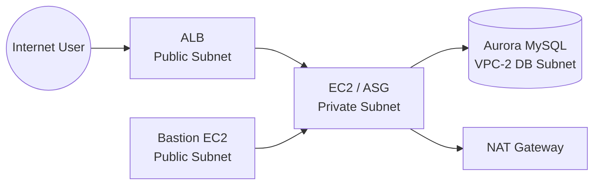
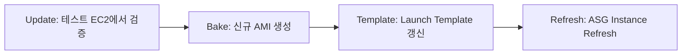

# InternationalPay 서비스 AWS 인프라 구축 문서

> **문서 목적:** 업로드된 과제 자료를 통합하여, **보안**, **고가용성**, **확장성**, **자동 배포**, **운영 모니터링** 중심의 실전용 기술 문서로 정리한다.

---


## 📚 목차

## 1. 📌 과제 개요
### 1.1 과제 목표
### 1.2 기술 스택
### 1.3 기본 조건 및 제한사항

## 2. 🏗 전체 아키텍처
### 2.1 아키텍처 개요
### 2.2 구성도 (Architecture Diagram)
### 2.3 설계 원칙

## 3. 🌐 네트워크 및 보안
### 3.1 VPC 구성
### 3.2 서브넷 설계
### 3.3 VPC Peering
### 3.4 라우팅 테이블
### 3.5 보안 그룹
### 3.6 KMS CMK

## 4. 💻 컴퓨팅 구성 (EC2)
### 4.1 Bastion EC2
### 4.2 Application EC2
### 4.3 환경 설정
### 4.4 IAM Role

## 5. 💾 데이터베이스
### 5.1 Aurora 구성
### 5.2 서브넷 그룹
### 5.3 보안 설정
### 5.4 접속 확인

## 6. 🧪 개발 및 테스트
### 6.1 애플리케이션
### 6.2 실행 및 테스트
### 6.3 디버깅

## 7. ⚙️ 배포 및 확장
### 7.1 AMI
### 7.2 Launch Template
### 7.3 ALB
### 7.4 ASG

## 8. 📊 모니터링
### 8.1 CloudWatch Agent
### 8.2 로그 설정
### 8.3 로그 확인

## 9. ✅ 체크리스트

## 10. ⚠️ 주의사항

## 11. 🧠 요약 및 Takeaway

---

## 1. 과제 개요
- **WorldPay** 유저 관리 시스템을 위한 AWS 인프라를 설계·구축한다.
- 핵심 목표는 다음과 같다.
  1. **중요 정보 보호**
  2. **고가용성 확보**
  3. **확장성 확보**
  4. **운영 자동화**

### 1.2 사용 기술 스택
| 구분 | 기술 |
|---|---|
| 네트워크 | VPC, VPC Peering |
| 컴퓨팅 | EC2, ALB, ASG |
| 데이터베이스 | RDS Aurora MySQL |
| 보안 | Secrets Manager, KMS |
| 모니터링 | CloudWatch |
| 개발 언어 | Python |
| OS | Amazon Linux 2023 |

### 1.3 기본 전제
- **리전:** `ap-northeast-2 (서울)`
- **OS 이미지:** **Amazon Linux 2023**
- **변수값:** 문제에서 지정된 값은 **반드시 반영**
- **금지사항:** 지급된 바이너리는 **수정 금지**
- **Bastion EC2**는 채점 과정에서 사용되므로 연결과 권한 문제를 방지해야 한다.

---

## 2. 전체 아키텍처

### 2.1 아키텍처 요약
- 인프라는 **2개의 VPC**로 분리한다.
  - **VPC-1:** 애플리케이션용
  - **VPC-2:** 데이터베이스용
- 두 VPC는 **VPC Peering**으로 연결한다.
- 외부 사용자는 **ALB**를 통해 애플리케이션에 접근한다.
- 애플리케이션 서버는 **Private Subnet**에 두고, DB는 별도 VPC의 Private 환경에 배치한다.

### 2.2 구조도


### 2.3 구성 원칙
- **외부 노출 최소화**
- **DB는 인터넷 비노출**
- **애플리케이션은 Private Subnet 배치**
- **멀티 AZ 기반 구성**
- **암호화 및 로그 수집 기본 적용**

---

## 3. 네트워크 및 보안

### 3.1 VPC 구성
| VPC | 역할 | 서브넷 |
|---|---|---|
| VPC-1 | 애플리케이션 VPC | Public Subnet, Private Subnet |
| VPC-2 | 데이터베이스 VPC | DB Subnet |

### 3.2 서브넷 배치
- **Public Subnet**
  - ALB
  - Bastion EC2
- **Private Subnet**
  - Application EC2
  - NAT Gateway를 통한 외부 통신
- **DB Subnet**
  - Aurora MySQL
  - 외부 인터넷 통신 차단

### 3.3 VPC Peering
- **VPC-1 ↔ VPC-2** 사이에 **Peering 연결**을 설정한다.
- 라우팅 테이블에 **Peering 경로**를 반드시 추가한다.
- 통신은 **Private IP 기반**으로만 처리한다.

> **주의:** Peering만 생성하고 라우팅을 추가하지 않으면 DB 통신이 되지 않는다.

### 3.4 보안 그룹 설계
| 대상 | 인바운드 포트 | 허용 소스 | 용도 |
|---|---:|---|---|
| ALB-SG | 80, 443 | `0.0.0.0/0` | 외부 트래픽 수신 |
| Bastion-SG | 22 | `0.0.0.0/0` | SSH 접속 |
| App-SG | 22, 8000 | `0.0.0.0/0` 또는 요구 조건에 맞는 범위 | 앱 서버 접근 |
| DB-SG | 3306 | VPC-1 CIDR | Aurora 접근 |

> **Tip:** 과제 조건에 따라 **80/443 outbound는 any open**으로 둘 수 있다.

### 3.5 KMS CMK
- 암호화 대상별로 **고객 관리형 KMS 키(CMK)**를 생성한다.
- 사용 예시:
  - Aurora 저장 데이터 암호화
  - 백업 및 스냅샷 암호화
  - Secrets Manager 연동
- 핵심 권한은 최소 권한 원칙으로 부여한다.

---

## 4. 컴퓨팅 및 애플리케이션

### 4.1 Bastion EC2
- **Public Subnet**에 배치
- **EIP**를 고정 할당
- 관리용 SSH 진입점으로 사용
- Bastion이 막히면 채점에 직접적인 문제가 생길 수 있으므로 주의

### 4.2 Test EC2 / Application EC2
- **Private Subnet**에 배치
- 테스트와 배포 검증, 실제 애플리케이션 실행에 사용
- 필수 작업:
  1. Python 3.12 / pip 설치
  2. FastAPI, boto3, pymysql, sqlalchemy, uvicorn 설치
  3. IAM Role 연결
  4. systemd 서비스 등록
  5. CloudWatch Logs 연동
  6. AMI 생성

### 4.3 패키지 설치 예시
```bash
sudo dnf install -y python3.12 python3.12-pip mariadb1011
python3.12 -m pip install fastapi pydantic[email] pymysql boto3 sqlalchemy passlib uvicorn
```

### 4.4 IAM Role 권한
애플리케이션 EC2에는 다음 권한이 필요하다.
| 서비스 | 권한 예시 | 용도 |
|---|---|---|
| Secrets Manager | `GetSecretValue` | DB 비밀 정보 조회 |
| KMS | `Decrypt` | 암호화 키 사용 |
| CloudWatch Logs | `CreateLogStream`, `PutLogEvents` | 로그 전송 |

### 4.5 systemd 서비스
`worldpay.service` 예시:

```ini
[Unit]
Description=worldpay service
After=network.target

[Service]
User=ec2-user
WorkingDirectory=/home/ec2-user
ExecStart=/home/ec2-user/.local/bin/uvicorn main:app --host 0.0.0.0 --port 8000
StandardOutput=append:/home/ec2-user/worldpay.log
Restart=always

[Install]
WantedBy=multi-user.target
```

### 4.6 서비스 관리
```bash
sudo systemctl daemon-reload
sudo systemctl enable --now worldpay
sudo systemctl status worldpay.service
```

> **경고:** `ExecStart` 경로, 사용자 계정, WorkingDirectory가 틀리면 서비스가 정상 시작되지 않는다.

---

## 5. 데이터베이스

### 5.1 Aurora MySQL 구성
- **Engine:** Aurora MySQL
- **배치:** VPC-2 DB Subnet
- **가용성:** Multi-AZ
- **보안:** 인터넷 접근 차단
- **암호화:** KMS CMK 적용
- **백업:** 자동 백업 및 PITR 활성화

### 5.2 서브넷 그룹
- VPC-2의 **AZ-a / AZ-b 서브넷**을 서브넷 그룹에 포함한다.

### 5.3 접근 규칙
- DB-SG는 **3306/TCP**만 허용
- 허용 소스는 **VPC-1 CIDR**로 제한
- 외부 인터넷 접근은 차단

### 5.4 접속 확인
```bash
nslookup worldpay-db.cluster-xxxxxxxx.ap-northeast-2.rds.amazonaws.com
mysql -h worldpay-db.cluster-xxxxxxxx.ap-northeast-2.rds.amazonaws.com -u admin -p
```

---

## 6. 개발 및 테스트

### 6.1 main.py 작성
- FastAPI 기반으로 작성
- 최소 구현 항목:
  - `/health`
  - `/health/db`
  - 사용자 관련 API

### 6.2 의존성 관리
```bash
pipreqs ./ --force
pip3.12 install -r requirements.txt
```

### 6.3 로컬 실행
```bash
python3.12 -m uvicorn main:app --host 0.0.0.0 --port 8000
```

### 6.4 테스트 예시
```bash
curl localhost:8000/health
curl localhost:8000/users
curl -X POST localhost:8000/users \
  -H "Content-Type: application/json" \
  -d '{"email":"test@test.com","name":"hong","password":"pass1004"}'
```

### 6.5 디버깅 포인트
- `main.py` 실행 에러
- DB 접속 실패
- security group 누락
- systemd 서비스 경로 오류
- CloudWatch 로그 미전송

---

## 7. ALB / Target Group / ASG

### 7.1 ALB
- **Internet-facing**
- **Public Subnet**의 두 AZ에 배치
- HTTP 80 → HTTPS 443 리디렉션 권장
- HTTPS 사용 시 ACM 인증서 적용

### 7.2 Target Group
| 항목 | 값 |
|---|---|
| Target Type | Instances |
| Protocol | HTTP |
| Port | 8000 |
| Health Check Path | `/health` |

### 7.3 ASG
- **Private Subnet**에 배치
- **Desired Capacity = 2**
- **Minimum = 2**
- **Maximum = 4~6**
- Multi-AZ로 구성

### 7.4 Launch Template
| 항목 | 내용 |
|---|---|
| AMI | 커스텀 AMI |
| Instance Type | 과제 지정 값 |
| Security Group | App-SG |
| IAM Role | Secrets Manager / KMS / CloudWatch 권한 포함 |

### 7.5 배포 흐름


> **핵심:** AMI 기반 롤링 배포로 **무중단 교체**를 구현한다.

---

## 8. 로깅 및 모니터링

### 8.1 CloudWatch Agent
- EC2에 설치하여 시스템 로그와 애플리케이션 로그를 수집한다.
- `worldpay.log`를 CloudWatch Logs로 전송한다.
- `/health` 관련 로그는 제외 필터를 둘 수 있다.

### 8.2 설치 및 적용
```bash
sudo dnf install amazon-cloudwatch-agent -y
sudo /opt/aws/amazon-cloudwatch-agent/bin/amazon-cloudwatch-agent-ctl \
  -a fetch-config -m ec2 \
  -c file:/opt/aws/amazon-cloudwatch-agent/etc/amazon-cloudwatch-agent.json -s
```

### 8.3 설정 파일 예시
```json
{
  "logs": {
    "logs_collected": {
      "files": {
        "collect_list": [
          {
            "file_path": "/home/ec2-user/worldpay.log",
            "log_group_name": "worldpay",
            "log_stream_name": "{instance_id}",
            "timestamp_format": "%Y-%m-%d %H:%M:%S",
            "filters": [
              {
                "type": "exclude",
                "expression": ".*\\/health.*"
              }
            ]
          }
        ]
      }
    }
  }
}
```

### 8.4 로그 확인
```bash
tail -f /home/ec2-user/worldpay.log
sudo journalctl -u worldpay -f
```

---

## 9. 배포 체크리스트

### 9.1 필수 완료 항목
1. VPC 생성
2. VPC Peering 설정
3. KMS CMK 생성
4. Aurora 생성 및 암호화 적용
5. Bastion EC2 생성 및 EIP 할당
6. Test EC2 구성
7. ALB / Target Group 생성
8. Launch Template 생성
9. ASG 생성
10. CloudWatch Agent 적용

### 9.2 점검 사항
- 리전이 **ap-northeast-2**인지 확인
- Name tag가 과제 요구와 일치하는지 확인
- Bastion 접근이 가능한지 확인
- DB 보안 그룹이 올바르게 연결되었는지 확인
- `/health` 응답이 정상인지 확인

---

## 10. 주의사항

> **주의:** 문제가 지정한 **변수 부분은 적절히 변경**해야 한다.

> **주의:** 과제에서 지급한 **바이너리는 절대 수정하지 않는다**.

> **주의:** `Bastion EC2`는 채점용 진입점이므로 연결 문제를 반드시 방지해야 한다.

> **주의:** `EC2 OS Image`는 **Amazon Linux 2023**을 사용한다.

> **주의:** 리소스는 명시가 없는 경우 **ap-northeast-2**에 생성한다.

---

## 11. 문서 요약 및 핵심 Takeaway

### 11.1 문서 요약
- **VPC 2개 분리 구조**로 애플리케이션과 DB를 격리한다.
- **VPC Peering**으로 내부 통신만 허용한다.
- **ALB + ASG**로 고가용성과 확장성을 확보한다.
- **Aurora MySQL + KMS**로 데이터 안정성과 보안을 강화한다.
- **systemd + CloudWatch**로 운영 자동화와 모니터링을 완성한다.

### 11.2 핵심 Takeaway
1. **보안**은 네트워크 분리와 최소 권한으로 완성한다.
2. **고가용성**은 Multi-AZ, ALB, ASG로 구현한다.
3. **운영 안정성**은 AMI 기반 롤링 배포와 CloudWatch로 확보한다.
4. **채점 안정성**은 Bastion, 리전, 태그, 바이너리 규칙 준수에 달려 있다.

---

## 12. 참고 자료
- 업로드된 과제 요약 자료
- README.md
- 클라우드컴퓨팅 1과제 PDF
